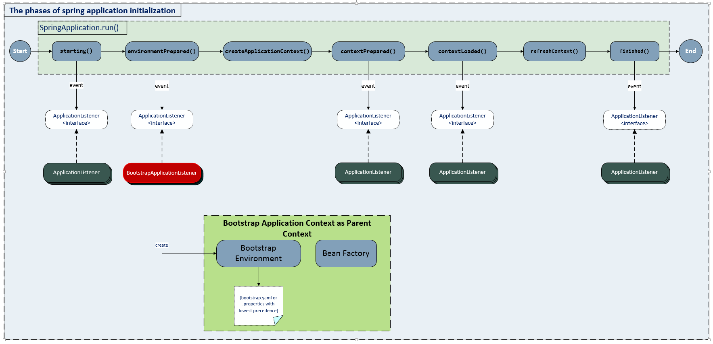
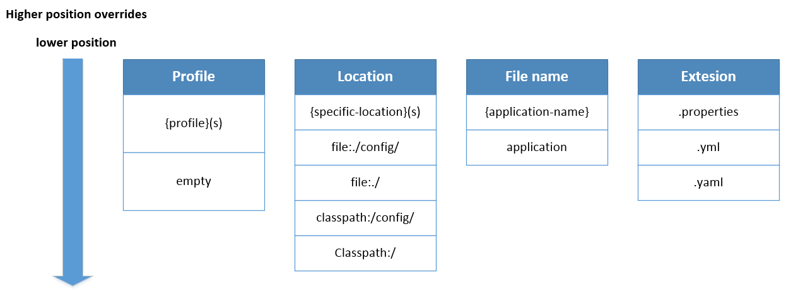

# Spring Core
### Inversion of Control
[Inversion of control (IoC)](https://en.wikipedia.org/wiki/Inversion_of_control) is a programming _**principle**_. IoC inverts the flow of control as compared to traditional control flow. In essence, IoC is about transferring control from your code to an external entity, often a container or framework.

There are several basic techniques to implement IoC: [(_Illustrating images_)](https://www.tutorialsteacher.com/Content/images/ioc/ioc-patterns.png)
+ Dependency injection
+ Template method design pattern
+ ...

<details>
  <summary>Inversion of Control (IoC) vs Traditional Style</summary>
  </br>
  + In the traditional style of programming, a class typically creates its own dependencies. This leads to tightly coupled components and makes testing and maintenance difficult.

  + In the IoC style, dependencies are injected into a class, promoting loose coupling and better testability.

</details>

<details>
  <summary>Dependency Injection (DI)</summary>
  </br>

  DI is a specific technique for achieving IoC. It involves providing dependencies to an object rather than creating them within the object itself. It's a common and popular implementation of the IoC principle.   

</details>

<details>
  <summary>Example</summary>
  </br>
  
  Imagine a car. In a traditional approach, the car would create its own engine. But with IoC, the car doesn't create the engine; it's provided by an external entity (like a car factory). The car simply uses the engine when needed.

_Tranditional Approach_
  ```
  public class Car {
      private Engine engine;
  
      public Car() {
          engine = new Engine();
      }
  
      public void start() {
          engine.start();
      }
  }
  ```
_IoC Approach with Dependency Injection_
  ``` 
  public class Car {
      private Engine engine;
  
      public Car() {
          engine = new Engine();
      }
  
      public void start() {
          engine.start();
      }
  }
  ```
</details>

<details>
  <summary>Who is dependency in IoC example</summary>
  </br>
  
```
public class Car {
    private Engine engine;

    public Car(Engine engine) {
        this.engine = engine;
    }
}
```

Consider a `Car` class. It depends on an `Engine` to function. Therefore, the `Engine` is a dependency of the `Car`.

+ The Car class is the dependent class.
+ The Engine class is the dependency.

The key point in IoC is that the `Car` doesn't create the `Engine` itself; it's provided (_injected_) from an external source.

</details>

### Spring Boot Layers
<details>
  <summary>Explain</summary>
  </br>
  
  1. Presentation Layer – Authentication & Json Translation
  2. Business Layer – Business Logic, Validation & Authorization
  3. Persistence Layer – Storage Logic
  4. Database Layer – Actual Database

</details>

### Bean
### Transaction Manager
#### How does @Transactional work ?
<details>
<summary><b><u>Propagation</u></b></summary>

+ REQUIRED: The REQUIRED propagation is default mode.
+ SUPPORTS: If a transaction exists, then the existing transaction will be used. If there isn't a transaction, it is executed non-transactional.
+ MANDATORY: If there is an active transaction, then it will be used. If there isn't an active transaction, then Spring throws an IllegalTransactionStateException exception.
+ NEVER: Spring throws an exception if there's an active transaction.

**Note**: `@Transactional` will have no effect if used to annotate private, protected, default methods. The proxy generator will ignore them.
</details>


### Bootstrap phases
<details>
<summary>Overview</summary>



</details>

### Validation

<details>
  <summary>Common Validation Annotations</summary>
  </br>

  + `@NotNull`: Ensures that the annotated field is not null.
  + `@NotEmpty`: Ensures that the annotated collection, map, or array is not empty.
  + `@NotBlank`: Ensures that the annotated string is not null and the trimmed length is greater than zero.
  + `@Size:`: Validates that the annotated element’s size is within the specified boundaries.
  + `@Min:`: Ensures that the annotated element is a number and its value is greater than or equal to the specified minimum.
  + `@Max:`: Ensures that the annotated element is a number and its value is less than or equal to the specified maximum.
  + `@Pattern:`: Ensures that the annotated string matches the specified regular expression.
  + `@Email:`: Validates that the annotated string is a valid email address.
  + `@Past:`: Ensures that the annotated date is in the past.
  + `@Future:`: Ensures that the annotated date is in the future.
</details>
<details>
  <summary>Custom Validation Annotations</summary>
  </br>

  ```
  @Documented
  @Target(ElementType.FIELD)
  @Retention(RetentionPolicy.RUNTIME)
  @Constraint(validatedBy = NumberValidation.class)
  public @interface IsNumber {
  
    String message() default "Invalid number";
    Class<?>[] groups() default {};  // Include this line
    Class<? extends Payload>[] payload() default {};  // Include this line
  }
  ```
  _Besides, the `message` attribute, the custom annotation also must have 2 attributes (`groups`, `payload`)._
  ```
  public class NumberValidation implements ConstraintValidator<IsNumber, String> {

    @Override
    public boolean isValid(String value, ConstraintValidatorContext context) {
      return NumberUtils.isParsable(value);
    }
  }
  ```

  ```
  @Data
  public class GoldRequest {
    @IsNumber
    private String value;
  }
  ```
  ```
  @RestController
  public class GoldController {
  
    @PostMapping("/test")
    public void test(@RequestBody @Valid GoldRequest goldRequest) {
      // do something
    }
  }
  ```
</details>
<details>
  <summary>@Valid vs @Validated</summary>
  </br>

  `@Valid`: Typically used to validate request bodies.
  ```
  public class User {
    @NotNull
    @Size(min = 2, max = 30)
    private String name;

    @NotNull
    @Email
    private String email;

    // Getters and setters
  }
  ```
  ```
  @RestController
  @RequestMapping("/api/users")
  public class UserController {
  
      @PostMapping
      public ResponseEntity<User> createUser(@RequestBody @Valid User user) {
          // Business logic to create a user
          return ResponseEntity.ok(user);
      }
  }
  ```

  `@Validated`: Often used to validation difference groups based on business.
  ```
  public class User {
    @NotNull(groups = BasicInfo.class)
    @Size(min = 2, max = 30, groups = BasicInfo.class)
    private String name;

    @NotNull(groups = BasicInfo.class)
    @Email(groups = BasicInfo.class)
    private String email;

    @NotNull(groups = AdvancedInfo.class)
    @Min(value = 18, groups = AdvancedInfo.class)
    private Integer age;

    // Getters and setters
  }
  ```
  ```
  @Service
  @Validated
  public class UserService {
  
      public User createUser(@Validated(BasicInfo.class) User user) {
          // Business logic to create a user
          return user;
      }
  
      public User updateUser(@Validated(AdvancedInfo.class) User user) {
          // Business logic to update a user
          return user;
      }
  }
  ```
In this example, the @Validated annotation is used to validate the User object with specific validation groups (BasicInfo and AdvancedInfo).
</details>

### Configuration precedence
<details>
<summary>Overview</summary>



</details>
<details>
<summary>Example</summary>

+ <b>{specific-location}(s)</b>/<b>{application-name}-{profiles}(s).properties</b>
+ {specific-location}(s)/{application-name}-{profiles}(s).yml
+ {specific-location}(s)/{application-name}-{profiles}(s).yaml
+ {specific-location}(s)/application-{profiles}(s).properties
+ ...
+ file:./config/{application-name}-{profiles}(s).properties
+ ...
+ file:./config/application-{profiles}(s).properties
+ ...
+ {specific-location}(s)/{application-name}.properties
</details>

Ref: https://stackoverflow.com/questions/65286686/difference-between-classpath-some-packages-vs-file-some-url-when-configuring-s

#### Transaction characteristics

+ Atomicity: A transaction must be a unit that should either succeed or fail
+ Consistency: 
+ Isolation:
+ Durability: 

### BeanFactory vs ApplicationContext

+ The `BeanFactory` provides the configuration framework and basic functionality
+ The `ApplicationContext` extends the `BeanFactory` and provides more functoions for enterprise-specific functionality.
### Understanding AOP Proxies

<details>
<summary>Understanding</summary>

  Let's come up with a sample to clearly understand what a the AOP proxies is
  
  Consider first the scenario have a un-proxied, nothing-special-about-it, straight object reference:
  
  ```
  public class SimplePojo implements Pojo {

     public void foo() {
        // this next method invocation is a direct
        call on the 'this' reference
        this.bar();
     }

     public void bar() {
        // some logic...
     }
  }
  ```
  ```
  public class Main {

     public static void main(String[] args) {

        Pojo pojo = new SimplePojo();

        // this is a direct method call on the 'pojo' reference
        pojo.foo();
     }
  }
  ```
  When the reference (`pojo`) that client code has is a proxy
  ```
  public class Main {

     public static void main(String[] args) {

        ProxyFactory factory = new ProxyFactory(new SimplePojo());
        factory.addInterface(Pojo.class);
        factory.addAdvice(new RetryAdvice());

        Pojo pojo = (Pojo) factory.getProxy();

        // this is a method call on the proxy!
        pojo.foo();
     }
  }
  ```
  
  The key thing to understand here is the `pojo` is a proxy instance, not a Pojo object. So when `pojo` invoke the `foo()` method, the proxy will be able to delegate to all of the interceptors (advice) that are relevant to that particular method call. 
  
  Interceptors may be used to log, do actions before and after the target method (`foo()`).
  
  However, once the call has finally reached the target object, the `SimplePojo` reference in this case, any method calls `this.` such as `this.bar()` or `this.foo()`,  are going to be invoked against the `this` reference, and not the _proxy_. In other word, in this case the `pojo` instance (`SimplePojo`) is being used, not a `pojo` proxy.
  
  Ref: https://docs.spring.io/spring-framework/docs/3.2.x/spring-framework-reference/html/aop.html
  
  Ref: https://jenkov.com/tutorials/java-reflection/dynamic-proxies.html
</details>

